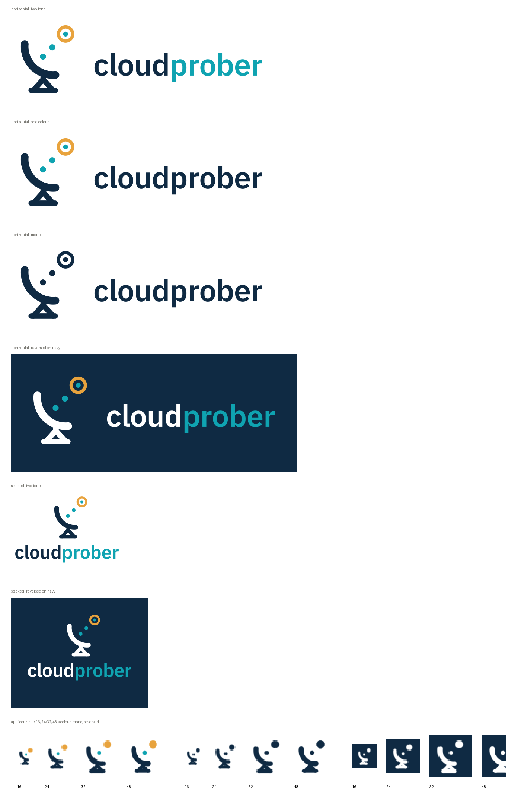

# Cloudprober logo

Mark: a dish on a mount, emitting a probe that lands on a target. Wordmark: IBM Plex Sans
SemiBold, outlined to paths — there is no live text and no font dependency in any file.



## Colour

| role   | hex       | use                                        |
| ------ | --------- | ------------------------------------------ |
| ink    | `#0F2A43` | dish, mount, `cloud`                       |
| signal | `#0FA3B1` | probe dots, target centre, `prober`        |
| target | `#E8A33D` | target ring                                |

On dark backgrounds the ink becomes `#FFFFFF`; signal and target stay as-is.

## Which file

| situation                                   | file                                       |
| ------------------------------------------- | ------------------------------------------ |
| default, light background                   | `svg/cloudprober-horizontal.svg`           |
| narrow or square space                      | `svg/cloudprober-stacked.svg`              |
| dark background                             | `svg/cloudprober-horizontal-ondark.svg`    |
| single-colour print, engraving, stamps      | `svg/cloudprober-horizontal-mono.svg`      |
| over a photo or colour, knocked out         | `svg/cloudprober-*-white.svg`              |
| avatar, sticker, mark alone                 | `svg/cloudprober-mark.svg`                 |
| favicon, app icon, anything under 48px      | `svg/cloudprober-icon.svg`                 |

`-onecolor` keeps the full-colour mark but sets the whole wordmark in ink — use it when the
two-tone split competes with surrounding colour.

## The icon is not the mark

`cloudprober-icon.svg` is a separate drawing, not a scaled-down `cloudprober-mark.svg`. The
full mark carries two probe dots and a ring target with an open centre. At 16px one device
pixel spans about 8.6 units of the artboard while that ring's counter is 5.5 units wide, so
it fills in and the target turns into a blob. The icon drops to one probe dot, thickens the
dish and mount, and replaces the ring with a solid disc.

**Use the icon below 48px. Use the mark at 48px and above.** Do not scale one to cover the
other's range.

## Clear space and minimum sizes

Clear space on all four sides is one cap height of the wordmark — 0.31× the height of the
horizontal lockup, or 0.22× the height of the stacked lockup.

| asset               | minimum        |
| ------------------- | -------------- |
| horizontal lockup   | 120px wide     |
| stacked lockup      | 90px wide      |
| mark alone          | 48px           |
| icon                | 16px           |

Aspect ratios are fixed: horizontal 2.83:1, stacked 1.32:1, mark and icon 1:1. Never
re-space the mark against the wordmark; the gap is 0.95× cap height and the mark is aligned
to the cap band with a 60% optical correction for its bottom-left weight.

## Favicon wiring

```html
<link rel="icon" href="/favicon.ico" sizes="32x32">
<link rel="icon" href="/cloudprober-icon.svg" type="image/svg+xml">
<link rel="apple-touch-icon" href="/apple-touch-icon.png">
<link rel="manifest" href="/site.webmanifest">
```

`favicon.ico` carries 16/32/48/64. `apple-touch-icon.png` is 180×180, opaque navy with iOS
padding — it must not be transparent. `icon-512-maskable.png` respects the 80% safe zone for
`purpose: "maskable"` in the web manifest.

Social card: `png/social-card-1200x630.png` for `og:image` and `twitter:image`.

## Regenerating

Every file in this directory is generated. The source is `tools/logogen/build_logo.py`,
which builds the whole kit from the geometry constants at the top of that file plus
`tools/logogen/IBMPlexSans-600.ttf` (a weight-600 instance of the Google Fonts variable
release, SIL OFL 1.1).

```sh
pip install fonttools cairosvg pillow numpy
python3 tools/logogen/build_logo.py --verify
```

That rewrites `docs/brand/` in place. Do not hand-edit anything here — change the constants
and rebuild, and every variant stays in sync:

| constant | controls |
| -------- | -------- |
| `K` | mark height as a multiple of cap height |
| `GAPF` / `STACK_GAPF` | mark-to-wordmark gap, horizontal / stacked |
| `TRACK` | wordmark tracking, in em |
| `OPT` | optical correction toward the ink centroid |
| `PAD` | viewBox padding, as a fraction of the long edge |

`--verify` re-checks the invariants that are easy to break: no live text or font dependency
in any SVG, the icon's mount post not breaking through the dish surface (rasterised and
measured column by column, not eyeballed), all four `favicon.ico` planes being true renders
at their own size rather than upsamples, and `apple-touch-icon.png` being 180×180 and opaque.

Two files here are not generated and are safe to edit by hand: this README and
`PREVIEW.png`.

## Publishing a change

Rebuilding this directory does not change the website. The copies the site and the favicon
set actually serve live in `docs/static/`, and have their own names and layout:

| `docs/brand/` | `docs/static/` |
| ------------- | -------------- |
| `svg/cloudprober-icon.svg` | `favicon.svg` |
| `favicon/favicon-16.png`, `-32.png` | `favicon-16x16.png`, `favicon-32x32.png` |
| `favicon/favicon.ico` | `favicon.ico` |
| `favicon/apple-touch-icon.png` | `apple-touch-icon.png` |
| `favicon/favicon-192.png`, `-512.png`, `icon-512-maskable.png` | `logo/cloudprober-icon-192.png`, `-512.png`, `-512-maskable.png` |
| `svg/cloudprober-{horizontal,stacked}{,-ondark}.svg`, `svg/cloudprober-mark.svg` | same names under `logo/` |
| `png/social-card-1200x630.png` | `logo/social-card.png` |

Cloudprober's own web interface (the status page, `/alerts`, `/logs`, `/config-*`, the
artifacts browser) is a second, smaller case. Its assets are embedded into the binary from
`web/static/`, so they are copied under their brand-kit names and served from
`<root>/static/`:

| `docs/brand/` | `web/static/` |
| ------------- | ------------- |
| `svg/cloudprober-horizontal.svg` | same name |
| `svg/cloudprober-icon.svg` | same name |
| `favicon/favicon.ico` | `favicon.ico` |

```sh
cp docs/brand/svg/cloudprober-horizontal.svg docs/brand/svg/cloudprober-icon.svg web/static/
cp docs/brand/favicon/favicon.ico web/static/
```

Unlike the `docs/static/` copies, these three are checked: `TestBrandAssetsMatchBrandKit`
in `web/static_test.go` compares them, through the embedded filesystem, against the sources
above and fails if they drift. Forgetting the copy breaks the build rather than silently
shipping a binary with the old logo.

The header lockup and the favicon links live in `web/resources/header.go` and
`web/resources/templates.go` respectively, and are shared by all three page shells
(`web/resources/templates.go`, `internal/surfacers/probestatus/html_tmpl.go`,
`probes/browser/artifacts/web/template.go`). The header is the lockup alone, at 170px wide
— comfortably over the 120px minimum, and the SVG's own viewBox padding supplies the clear
space — so it sits on the page background with no bar or padding of its own, and the rule
under it does the separating. Page links belong in the block below that rule, not up beside
the lockup.

The homepage diagram is a third case. `docs/static/homepage.svg` is a draw.io export, and
its central node is the on-dark horizontal lockup — embedded, not linked, and embedded
twice: the rendered body inlines the lockup's paths, and the draw.io source in the root
element's `content=` attribute carries the same file base64'd into the `image=` style of
the `cloudprober-wordmark` cell. Neither copy is reached by the table above, so a lockup
change has to be pushed through by hand:

1. Open `docs/static/homepage.svg` in draw.io — the embedded source is the editable copy.
2. Replace the image on the `cloudprober-wordmark` cell with the new
   `svg/cloudprober-horizontal-ondark.svg`. It is a child of the navy box cell
   `xQNlQs2I_ULp-5fTuDjN-4` and sized `143.01 x 50.53` inside that box's `163.75 x 75`,
   which is the lockup plus one cap height of clear space on all four sides. Keep the box
   cell's id and geometry — seven edges anchor to it.
3. Re-export `homepage.svg` with the source still embedded, then re-render
   `homepage.png` from it at 1364 x 864 — the diagram at `scale=2` with a 96-unit
   margin.

Step 3 does not need draw.io desktop. Any browser renders the export faithfully, because
the lockup is outlined and the rest of the diagram's text is `foreignObject` HTML:

```sh
cd docs/static
printf '<style>body{margin:0}</style>' > wrap.html
google-chrome --headless --disable-gpu --hide-scrollbars \
  --force-device-scale-factor=1 --default-background-color=00000000 \
  --window-size=1364,864 --screenshot=homepage.png wrap.html && rm wrap.html
```

The wrapper is what pins the output size; screenshotting the `.svg` directly leaves it to
the browser's default viewport. `--default-background-color=00000000` keeps the
transparency — without it the rounded corners of the outer card pick up a white ground.

Do not reach for the rasteriser `build_logo.py` uses. cairosvg has no `foreignObject`
support, and neither does rsvg; the lockup would come through fine, since it is outlined,
but every text label in the diagram would silently vanish.

`docs/static/site.webmanifest` is maintained separately — it carries site-absolute paths and
the site's own theme colours, so it is not a copy of the one here.

## Licence

IBM Plex Sans is SIL OFL 1.1. The wordmark is outlined, so nothing needs to ship the font,
and the OFL reserved-font-name clause does not apply to outlined artwork.
