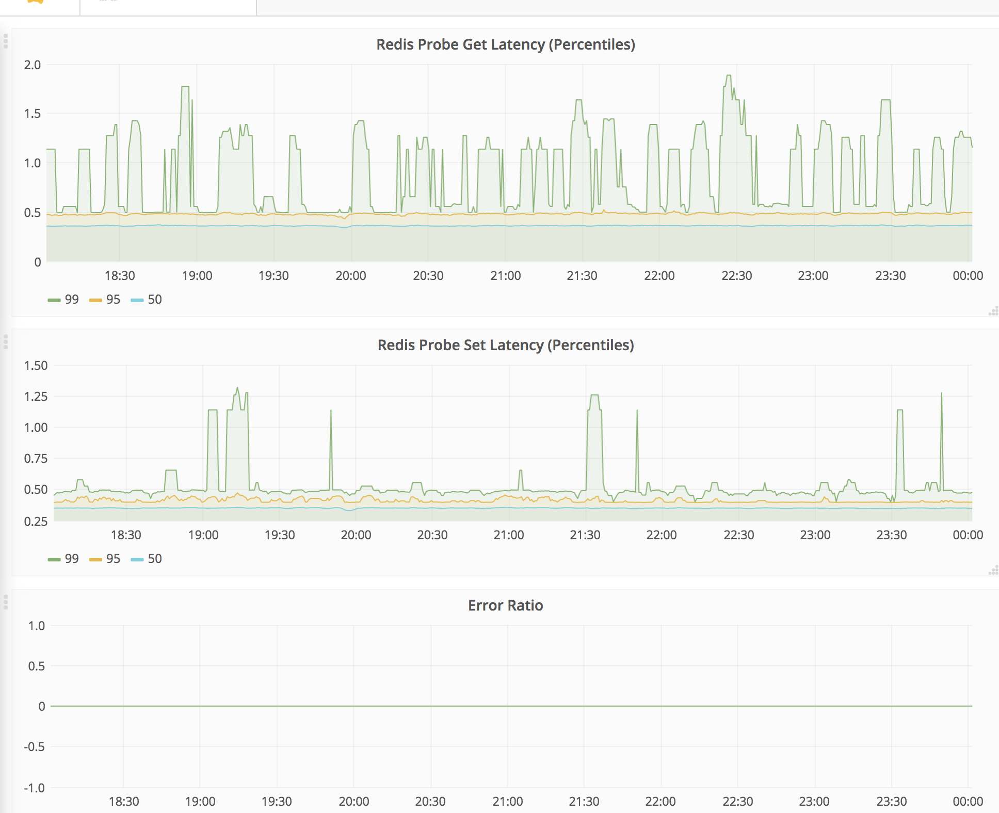
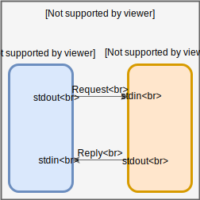

---
menu:
  docs:
    parent: "how-to"
    weight: 13
title: "External Probe"
date: 2022-11-01T17:24:32-07:00
---

External probe type allows you to run arbitrary, complex probes through
Cloudprober. An external probe runs an independent external program for actual
probing. Cloudprober calculates probe metrics based on program's exit status
and time elapsed in execution.

Cloudprober also allows external programs to provide additional metrics.
Every message sent to `stdout` will be parsed as a new metrics to be emitted.
For general logging you can use another I/O stream like `stderr`.

## Sample Probe

To understand how it works, lets create a sample probe that sets and gets a key
in a redis server. Here is the `main` function of such a probe:

```go
func main() {
    var client redis.Client
    var key = "hello"
    startTime := time.Now()
    client.Set(key, []byte("world"))
    fmt.Printf("op_latency_ms{op=set} %f\n", float64(time.Since(startTime).Nanoseconds())/1e6)

    startTime = time.Now()
    val, _ := client.Get("hello")
    log.Printf("%s=%s", key, string(val))
    fmt.Printf("op_latency_ms{op=get} %f\n", float64(time.Since(startTime).Nanoseconds())/1e6)
}
```

https://github.com/cloudprober/cloudprober/blob/master/examples/external/redis_probe.go

This program sets and gets a key in redis and prints the time taken for both operations.
`op_latency_ms{op=get|set}` will be emitted as metrics. You could also define your own labels using this format:

Cloudprober can use this program as an external probe, to verify
the availability and performance of the redis server. This program assumes that
redis server is running locally, at its default port. For the sake of
demonstration, lets run a local redis server (you can also easily modify this
program to use a different server.)

```bash
#!bash
OS=$(uname)
[[ "$OS" == "Darwin" ]] && brew install redis
[["$OS" == "Linux"]] && sudo apt install redis
```

Let's compile our probe program (redis_probe.go) and verify that it's working
as expected:

```bash
#!bash
CGO_ENABLED=0 go build -ldflags “-extldflags=-static” examples/external/redis_probe.go
./redis_probe
2022/02/24 12:39:45 hello=world
op_latency_ms{op=set} 22.656588
op_latency_ms{op=get} 2.173560
```

## Configuration

Here is the external probe configuration that makes use of this program:

Full example in [examples/external/cloudprober.cfg](https://github.com/cloudprober/cloudprober/blob/master/examples/external/cloudprober.cfg).

```bash
# Run an external probe that executes a command from the current working
# directory.
probe {
  name: "redis_probe"
  type: EXTERNAL
  targets { dummy_targets {} }
  external_probe {
    mode: ONCE
    command: "./redis_probe"
  }
}
```

Note: To pass target information to your external program as arguments use the `@label@` notation.
Supported fields are: `@target@`, `@address@`, `@port@`, `@probe@`, and target labels like `@target.label.fqdn@`.

```bash
command: "./redis_probe" -host=@address@ -port=@port@
```

Running it through cloudprober, you'll see the following output:

```bash
# Launch cloudprober
cloudprober --config_file=cloudprober.cfg

cloudprober 1519..0 1519583408 labels=ptype=external,probe=redis_probe,dst= success=1 total=1 latency=12143.765
cloudprober 1519..1 1519583408 labels=ptype=external,probe=redis_probe,dst=,op=get op_latency_ms=0.516 get_latency_ms=0.491
cloudprober 1519..2 1519583410 labels=ptype=external,probe=redis_probe,dst= success=2 total=2 latency=30585.915
cloudprober 1519..3 1519583410 labels=ptype=external,probe=redis_probe,dst=,op=set op_latency_ms=0.636 get_latency_ms=0.994
cloudprober 1519..4 1519583412 labels=ptype=external,probe=redis_probe,dst= success=3 total=3 latency=42621.871
```

You can import this data in prometheus following the process outlined at:
[Running Prometheus](). Before doing that, let's make it more interesting.

## Distributions

How nice will it be if we could find distribution of the set and get latency. If tail latency was too high, it could explain the random timeouts in your application. Fortunately, it's very easy to create distributions in Cloudprober. You just need to add the following section to your probe definition:

Full example in [examples/external/cloudprober_aggregate.cfg](https://github.com/cloudprober/cloudprober/blob/master/examples/external/cloudprober_aggregate.cfg).

```bash
# Run an external probe and aggregate metrics in cloudprober.
...
output_metrics_options {
  aggregate_in_cloudprober: true

  # Create distributions for get_latency_ms and set_latency_ms.
  dist_metric {
    key: "op_latency_ms"
    value: {
      explicit_buckets: "0.1,0.2,0.4,0.6,0.8,1.0,2.0"
    }
  }
}
```

This configuration adds options to aggregate the metrics in the cloudprober and
configures "op_latency_ms" as a distribution metric with explicit buckets.
Cloudprober will now build cumulative distributions using
for these metrics. We can import this data in Stackdriver or Prometheus and get
the percentiles of the "get" and "set" latencies. Following screenshot shows the
grafana dashboard built using these metrics.

<a href="redis_probe_screenshot.png"></a>

## Server Mode

The probe that we created above forks out a new `redis_probe` process for every
probe cycle. This can get expensive if probe frequency is high and the process is big (e.g. a Java binary). Also, what if you want to keep some state across probes, for example, lets say you want to monitor performance over HTTP/2 where you keep using the same TCP connection for multiple HTTP requests. A new process
every time makes keeping state impossible.

External probe's server mode provides a way to run the external probe process in daemon mode. Cloudprober communicates with this process over stdout/stdin (connected with OS pipes), using serialized protobuf messages. Cloudprober comes with a serverutils package that makes it easy to build external probe servers in Go. To pass target info into the probe, use the @label@ notation in `external_probe.options`.



Please see the code at
[examples/external/redis_probe.go](https://github.com/cloudprober/cloudprober/blob/master/examples/external/redis_probe.go) for server mode implementation of the above probe. Here is the corresponding
cloudprober config to run this probe in server mode: [examples/external/cloudprober_server.cfg](https://github.com/cloudprober/cloudprober/blob/master/examples/external/cloudprober_server.cfg).

In server mode, if external probe process dies for reason, it's restarted by Cloudprober.
