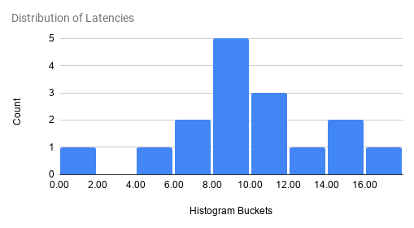

---
menu:
  docs:
    parent: "how-to"
    weight: 24
linktitle: "Percentiles and Histograms"
title: "Percentiles, Histograms, and Distributions"
date: 2022-09-01T17:24:32-07:00
---

Percentiles give you a deeper insight into how your system is behaving. For example, if your application's response latency is very low 94 times out 100 but very high for the remaining 6 times, your average latency will still be low but it won't be a great experience for your users. In other words, this is the case where your 95th percentile latency is high, even though your average and median (50th-%ile) latency is very low.

A typical way to measure percentiles from continuous monitoring data, which you may have to aggregate across various sources, is to use histograms (also called, distributions). In a histogram, you assign the incoming data points (samples) to pre-defined buckets. Each data point increases the count for the bucket that it falls into; data point itself is discarded after that. You can take a look at the bucket counts at any point of time and get an estimate of the percentiles. Histograms make it easy to aggregate data across multiple entities, for example, from probes running on multiple machines.

Following diagram shows distribution of latencies into 9 equal sized histogram buckets:



(_Above diagram shows histogram for the following samples:
5.1, 6.2, 9.0, 12.1, 8.3, 9.7, 9.4, 10.3, 14.1, 11.2, 16.6, 9.9, 10.6, 14.1, 0.9, 7.1, 17.7_)

## Histograms in Cloudprober (Distributions)

Cloudprober uses a metric type called 'distribution' to create and export histograms. Cloudprober supports creating distributions for probe latencies, and for metrics generated from external probe payloads. To create distributions, you have to specify how the data should be bucketed -- you can either explicitly specify all bucket bounds, use exponential buckets type which generates bucket bounds from only a few variables, or use [native buckets](#native-histograms), where you don't specify any bucket bounds at all.

Here is an example of using explicit buckets for latencies:

```
probe {
  name: "..."
  type: HTTP
  targets {
    host_names: "..."
  }

  # Local and Intra-regional latencies
  latency_unit: "ms"
  latency_distribution {
    explicit_buckets: "0.01,0.1,0.15,0.2,0.25,0.35,0.5,0.75,1.0,1.5,2.0,3.0,4.0,5.0,10.0,15.0,20.0"
  }
}
```

## Configuring distributions

As seen in the example above, for latencies you configure distribution at the probe level by adding a field called `latency_distribution`. Without this field, cloudprober exports only cumulative latencies. To create distributions from an external probe's data, take a look at the external probe's [documentation](/docs/how-to/external-probe/#distributions).

Format for the distribution field is in turn defined in [dist.proto](https://github.com/cloudprober/cloudprober/blob/master/metrics/proto/dist.proto).

```proto
// Dist defines a Distribution data type.
message Dist {
  oneof buckets {
    // Comma-separated list of lower bounds, where each lower bound is a float
    // value. Example: 0.5,1,2,4,8.
    string explicit_buckets = 1;

    // Exponentially growing buckets
    ExponentialBuckets exponential_buckets = 2;

    // Prometheus-style native histogram buckets.
    // EXPERIMENTAL: this option and its fields can change.
    NativeBuckets native_buckets = 3;
  }
}

// ExponentialBucket defines a set of num_buckets+2 buckets:
//   bucket[0] covers (−Inf, 0)
//   bucket[1] covers [0, scale_factor)
//   bucket[2] covers [scale_factor, scale_factor*base)
//   ...
//   bucket[i] covers [scale_factor*base^(i−2), scale_factor*base^(i−1))
//   ...
//   bucket[num_buckets+1] covers [scale_factor*base^(num_buckets−1), +Inf)
// NB: Base must be at least 1.01.
message ExponentialBuckets {
  float scale_factor = 1; // default = 1.0
  float base = 2;         // default = 2
  uint32 num_buckets = 3; // default = 20
}

// NativeBuckets defines Prometheus-style native histogram buckets.
message NativeBuckets {
  // Bucket resolution. Valid values: -4 to 8.
  optional int32 schema = 1; // default = 3
}
```

## Native histograms

_Native histograms are experimental: the `native_buckets` option and its
fields can change._

With explicit and exponential buckets, you have to know the range of your data
up front. Buckets that are too wide give you poor percentiles, and adding
buckets later changes your time series. Native buckets, modeled after
[Prometheus native histograms](https://prometheus.io/docs/specs/native_histograms/),
don't have this problem:

- **You don't configure bucket bounds.** Bucket boundaries are fixed: each
  bucket's upper bound is a constant factor times its lower bound, at every
  scale. A 2ms sample and a 20s sample both land in a bucket that's about 9%
  wide (with the default schema).
- **Buckets are sparse.** Only the buckets that have samples are stored and
  exported. A typical latency distribution uses 20 to 30 buckets.
- **A histogram is a single time series** in Prometheus, instead of one series
  for each bucket.

To use them, set `native_buckets` in the distribution:

```
probe {
  name: "..."
  type: HTTP
  targets {
    host_names: "..."
  }

  latency_unit: "ms"
  latency_distribution {
    native_buckets {}
  }
}
```

### Resolution (schema)

`schema` sets how wide the buckets are. Each bucket's upper bound is
`2^(2^-schema)` times its lower bound. In other words, for schema 0 and above,
each power of 2 (1 to 2, 2 to 4, and so on) is split into `2^schema` buckets:

| schema      | bucket width | buckets for each power of 2 |
| ----------- | ------------ | --------------------------- |
| -4          | 65536x       | 1/16                        |
| -2          | 16x          | 1/4                         |
| 0           | 2x           | 1                           |
| 1           | 41%          | 2                           |
| 2           | 19%          | 4                           |
| 3 (default) | 9%           | 8                           |
| 4           | 4.4%         | 16                          |
| 5           | 2.2%         | 32                          |
| 8           | 0.3%         | 256                         |

A higher schema gives you more accurate percentiles and more buckets. The
default is good for most cases; use 4 or 5 if you need tighter percentiles.

### How native histograms are exported

| Surfacer   | What you get                                                                                |
| ---------- | ------------------------------------------------------------------------------------------- |
| Prometheus | Native histograms, if Prometheus scrapes them (see below).                                  |
| OTel       | [Exponential histograms](https://opentelemetry.io/docs/specs/otel/metrics/data-model/#exponentialhistogram), which use the same buckets. |
| Stackdriver | Not supported. These distributions are skipped, with a warning in the logs.                |
| Postgres, BigQuery, CloudWatch, Datadog | Regular buckets: one for each bucket between the smallest and the largest one with samples. |

If only some of your probes use `latency_distribution`, give the latency
metric a different name for those probes using `latency_metric_name` (for
example, `latency_dist`). Otherwise the same metric name is a histogram for
some probes and a number for others, and queries on it mix the two.

## Percentiles and Heatmap

Now that we've configured cloudprober to generate distributions, how do we make use of this new information. This depends on the monitoring system (prometheus, stackdriver, postgres, etc) you're exporting your data to.

Both prometheus and [stackdriver](/docs/surfacers/stackdriver/) support computing and plotting percentiles from the distributions data. Stackdriver can natively create heatmaps from distributions while for prometheus you need to use grafana to create heatmaps.

### Stackdriver (Google Cloud Monitoring)

Stackdriver automatically shows percentile aggregator for distribution metrics in metrics explorer. You can also use Stackdriver MQL to create percentiles (see [stackdriver documentation](/docs/surfacers/stackdriver/#accessing-the-data) for other usages of MQL for cloudprober metrics):

```shell
fetch gce_instance
| metric 'custom.googleapis.com/cloudprober/http/google_homepage/latency'
| filter (resource.zone == 'us-central1-a')
| align delta(1m)
| every 1m
| group_by [resource.zone], [value_latency_percentile: percentile(value.latency, 95)]
```

Stackdriver has [detailed documentation](https://cloud.google.com/monitoring/charts/charting-distribution-metrics) on charting distributions.

### Prometheus

Cloudprober surfaces distributions to prometheus as prometheus metric type [histogram](https://prometheus.io/docs/concepts/metric_types/#histogram). Here is an example of prometheus metrics page created by cloudprober:

```bash
# TYPE latency histogram
latency_sum{ptype="http",probe="my_probe",dst="hostA"} 77557.14022499947 1607766316442
latency_count{ptype="http",probe="my_probe",dst="hostA"} 172150 1607766316442
latency_bucket{ptype="http",probe="my_probe",dst="hostA",le="0.01"} 0 1607766316442
latency_bucket{ptype="http",probe="my_probe",dst="hostA",le="0.1"} 0 1607766316442
...
...
latency_bucket{ptype="http",probe="my_probe",dst="hostA",le="75"} 172150 1607766316442
latency_bucket{ptype="http",probe="my_probe",dst="hostA",le="100"} 172150 1607766316442
latency_bucket{ptype="http",probe="my_probe",dst="hostA",le="+Inf"} 172150 1607766316442
```

Fortunately there is already a plenty of good documentation on how to make use of histograms in prometheus and grafana:

- [Grafana blog](https://grafana.com/blog/2020/06/23/how-to-visualize-prometheus-histograms-in-grafana/) on how to visualize prometheus histograms in grafana.
- Prometheus documentation on [histrograms](https://prometheus.io/docs/practices/histograms/).

#### Native histograms in Prometheus

There are two ways to get cloudprober's [native histograms](#native-histograms)
into Prometheus.

**Scraping.** Prometheus gets native histograms only in the protobuf format,
and it asks for that format when `scrape_native_histograms` is set (Prometheus
3.8 or later; older versions need `--enable-feature=native-histograms`
instead):

```yaml
scrape_configs:
  - job_name: cloudprober
    scrape_native_histograms: true
    static_configs:
      - targets: ["cloudprober:9313"]
```

Cloudprober serves the protobuf format only if it has a native histogram to
export and the scraper asks for it. In all other cases, it serves the text
format, as it always has. In the text format, a native histogram has only the
`_sum`, `_count` and `+Inf` bucket series, so you can't compute percentiles
from a text scrape.

**OTLP.** Prometheus can also receive metrics over OTLP
(`--web.enable-otlp-receiver`), and it stores OTel exponential histograms as
native histograms. Point the OTel surfacer at Prometheus:

```
surfacer {
  type: OTEL
  otel_surfacer {
    otlp_http_exporter {
      endpoint_url: "http://prometheus:9090/api/v1/otlp/v1/metrics"
    }
  }
}
```

Metric names get the `cloudprober_` prefix and the unit as a suffix this way,
for example `cloudprober_latency_milliseconds`.

A native histogram is one series, named after the metric. There are no
`_bucket`, `_sum` and `_count` series, and no `le` label:

```
# 95th percentile latency for each probe and target
histogram_quantile(0.95, sum by (probe, dst) (rate(latency[5m])))

# Average latency
histogram_sum(rate(latency[5m])) / histogram_count(rate(latency[5m]))
```

If all you want is fewer time series and you're happy with the buckets you
have, Prometheus can also convert regular histograms into native histograms
with custom buckets while scraping. Set `convert_classic_histograms_to_nhcb:
true` in the scrape config; no change is needed in cloudprober.

## More Resources

1. [The Problem with Percentiles – Aggregation brings Aggravation](https://www.circonus.com/2018/11/the-problem-with-percentiles-aggregation-brings-aggravation/).
1. [Why percentiles don't work the way you think](https://orangematter.solarwinds.com/2016/11/18/why-percentiles-dont-work-the-way-you-think/).
