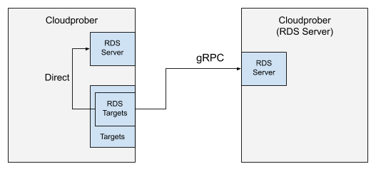

---
menu:
  docs:
    parent: how-to
    name: "Resource Discovery Service"
    weight: 110
title: "Resource Discovery Service"
---

 Note: This is an advanced topic. From a user's
perspective, it's only useful if you want to scale targets discovery by
centralizing it.

Cloudprober internally defines and uses a protocol called resource discovery
service (RDS[^1]) for targets discovery[^2]. It helps provide a consistent
interface between the targets subsystem, actual resource discovery mechanisms,
and probes subsystem. It also provides a way to move targets discovery into an
independent process, which can be used to reduce the upstream API traffic.

[^1]:
    Note that this has nothing to do with the AWS RDS product. Naming is
    unfortunate.

[^2]:
    In fact, all dynamically discovered targets use the `RDS protocol` behind
    the scene.

## Protocol `(rds_targets)`

To understand the RDS protocol, let's look at the `rds_targets` targets type.
You can think of `rds_targets` as a configuration interface to the RDS service.
When you configure `rds_targets`, you're creating an RDS client that talks to an
RDS backend that is either part of the same process (default) or available over
gRPC (usefule for centralizing the upstream API calls).



Here are the
[RDS targets](https://github.com/cloudprober/cloudprober/blob/86a1d1fcd2f8505c45ff462d69458fd5b9964e5f/targets/proto/targets.proto#L12)
configuration options:

```proto
message RDSTargets {
  // RDS server options, for example:
  // rds_server_options {
  //   server_address: "rds-server.xyz:9314"
  //   oauth_config: {
  //     ...
  //   }
  // }
  // Default is to use the local server if any.
  optional rds.ClientConf.ServerOptions rds_server_options = 1;

  // Resource path specifies the resources to return. Resources paths have the
  // following format:
  // <resource_provider>://<resource_type>/<additional_params>
  //
  // Examples:
  // For GCE instances in projectA: "gcp://gce_instances/<projectA>"
  // Kubernetes Pods : "k8s://pods"
  optional string resource_path = 2;

  // Filters to filter resources by. Example:
  // filter {
  //   key: "namespace"
  //   value: "mynamesspace"
  // }
  // filter {
  //   key: "labels.app"
  //   value: "web-service"
  // }
  repeated rds.Filter filter = 3;

  // IP config to specify the IP address to pick for a resource. IPConfig
  // is defined here:
  // https://github.com/cloudprober/cloudprober/blob/master/rds/proto/rds.proto
  optional rds.IPConfig ip_config = 4;
}
```

Most options are explained in the comments for a quick reference. Here is the
further explanation of some of these options:

### rds_server_options

This
[field](https://github.com/cloudprober/cloudprober/blob/86a1d1fcd2f8505c45ff462d69458fd5b9964e5f/rds/client/proto/config.proto#L19)
specifies how to connect to the RDS server: server address and security options
(OAuth and TLS). If left unspecified, it connects to the local server if any
(started through `rds_server` option). Next up it looks for the
`rds_server_options` in
[global_targets_options](https://github.com/cloudprober/cloudprober/blob/86a1d1fcd2f8505c45ff462d69458fd5b9964e5f/targets/proto/targets.proto#L125).

### resource_path

Resource path specifies the resources we are interested in. It consists of a
_resource provider_, _resource type_ and an optional _relative path_:
`<resource_provider>://<resource_type>/<optional_relative_path>`

- `resource_provider`: Resource provider is a generic concept within the RDS
  protocol but usually maps to the cloud provider. Cloudprober RDS server
  currently implements the Kubernetes (k8s), GCP (gcp), and AWS (aws) resource
  providers. We plan to add more resource providers in future.
- `resource_type`: Available resource types depend on the providers, for
  example, for k8s provider supports the following resource types: _pods_,
  _endpoints_, and _services_.
- `optional_relative_path`: For most resource types you can specify resource
  name in the resource path itself, e.g. `k8s://services/cloudprober`.
  Alternatively, you can use filters to filter by name, resource, etc.

### filter

Filters are key-value strings that can be used to filter resources by various
fields. Filters depend on the resource types, but most resources support
filtering by name and labels.

```shell
# Return resources that start with "web" and have label "service:service-a"
...
 filter {
   key: "name"
   value: "^web.*"
 }
 filter {
   key: "labels.service"
   value: "service-a"
 }
```

- Filters supported by kubernetes resources:
  - [k8s filters](https://github.com/cloudprober/cloudprober/blob/e4a0321d38d75fb4655d85632b52039fa7279d1b/rds/kubernetes/kubernetes.go#L55).
- Filters supported by GCP:
  - [GCE Instances](https://github.com/cloudprober/cloudprober/blob/e4a0321d38d75fb4655d85632b52039fa7279d1b/rds/gcp/gce_instances.go#L44)
  - [Forwarding Rules](https://github.com/cloudprober/cloudprober/blob/b6e268e0bd11072f5d86b704306bc1100a8a5da8/rds/gcp/forwarding_rules.go#L44)
  - [Pub/Sub Messages](https://github.com/cloudprober/cloudprober/blob/e4a0321d38d75fb4655d85632b52039fa7279d1b/rds/gcp/pubsub.go#L34)
- AWS resource types:
  - **ec2_instances**: EC2 instances
  - **rds_clusters**: RDS database clusters
  - **rds_instances**: RDS database instances

### AWS Provider

The AWS provider supports discovering resources across AWS services. To use the AWS
provider, your Cloudprober instance needs AWS credentials configured. The provider
follows the standard AWS credentials chain:

1. Environment variables (`AWS_ACCESS_KEY_ID`, `AWS_SECRET_ACCESS_KEY`)
2. Shared credentials file (`~/.aws/credentials`)
3. IAM role (when running on EC2)
4. ECS task role (when running in ECS)

#### AWS Resource Configuration

Each AWS resource type supports the following common options:

- **region**: AWS region to query (e.g., "us-east-1", "eu-west-1")
- **profile_name**: Optional AWS profile name from credentials file
- **re_eval_sec**: How often to refresh the resource list (default: 600 seconds)

RDS-specific resources (rds_instances and rds_clusters) support additional options:

- **identifier**: Filter by specific DB identifier or ARN
- **filter**: AWS API filters (e.g., "db-instance-status=available")
- **include_shared**: Include resources shared from other AWS accounts

Example AWS resource paths:

```shell
# All EC2 instances in the configured region
resource_path: "aws://ec2_instances"

# RDS database instances
resource_path: "aws://rds_instances"

# RDS database clusters
resource_path: "aws://rds_clusters"
```

## Running RDS Server

RDS server can either be run as an independent process, or it can be a part of
the main prober process. Former mode is useful for large deployments where you
may want to reduce the API upcall traffic (for example, to GCP). For example, if
you run 1000+ prober processes, it will be much more economical from the API
quota usage point of view to have a centralized RDS service with much fewer
(2-3) instances instead of having each prober process make its own API calls.

RDS server can be added to a cloudprober process using the `rds_server` stanza.
If you're running RDS server in a remote process, you'll have to enable gRPC
server in that process (using `grpc_port`) so that other instances can access it
remotely.

Here is an example RDS server configuration:

```shell
rds_server {
  # GCP provider to discover GCP resources.
  provider {
    gcp_config {
      # Projects to discover resources in.
      project: "test-project-1"
      project: "test-project-2"

      # Discover GCE instances in us-central1.
      gce_instances {
        zone_filter: "name = us-central1-*"
        re_eval_sec: 60  # How often to refresh, default is 300s.
      }

      # GCE forwarding rules.
      forwarding_rules {}
    }
  }

  # Kubernetes targets are further discussed at:
  # https://cloudprober.org/how-to/run-on-kubernetes/#kubernetes-targets
  provider {
    kubernetes_config {
      endpoints {}
    }
  }

  # AWS provider to discover AWS resources.
  provider {
    aws_config {
      # AWS region to discover resources in.
      region: "us-east-1"

      # Optional: AWS profile name for authentication.
      # If not specified, uses default AWS credentials chain.
      # profile_name: "my-aws-profile"

      # Discover EC2 instances.
      ec2_instances {
        re_eval_sec: 60  # How often to refresh, default is 600s.
      }

      # Discover RDS database instances.
      rds_instances {
        # Optional: filter by specific instance identifier or ARN.
        # identifier: "my-db-instance"
        # filter: "db-instance-status=available"
        re_eval_sec: 60
      }

      # Discover RDS database clusters.
      rds_clusters {
        re_eval_sec: 60
      }
    }
  }
}
```

For the remote RDS server setup, if accessing over external network, you can
secure the underlying gRPC communication using
[TLS certificates](https://github.com/cloudprober/cloudprober/blob/master/config/proto/config.proto#L91).

## Remote RDS Server Example

_Cloudprober config:_

```shell
probe {
  rds_targets {
    rds_server_options {
      server_address: "rds-service:9314"

      # mTLS configuration
      tls_config {
        ca_cert_file: "/vol/certs/server_ca.crt" # To verify the server
        tls_cert_file: "/vol/certs/client.crt"   # Own cert to present to server
        tls_key_file: "/vol/certs/client.key"    # Own cert's private key
      }
    }

    resource_path: "gcp://gce_instances"
    filter {
      key: "name"
      value: "ins-cf-.*"
    }
  }
}
```

_On a different cloudprober instance:_

```shell
...
rds_server {
  provider {
    gcp_config {
      instances {
        zone_filter: "us-east1-a"
      }
    }
  }
}

grpc_tls_config {
  ca_cert_file: "/vol/certs/client_ca.crt" # To verify the server
  tls_cert_file: "/vol/certs/server.crt"   # Own cert to present to client
  tls_key_file: "/vol/certs/server.key"    # Own cert's private key
}

# Required for remote access
grpc_port: 9314
```
